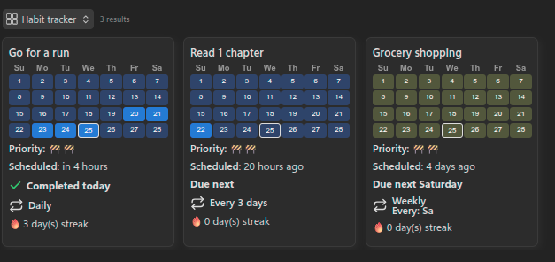
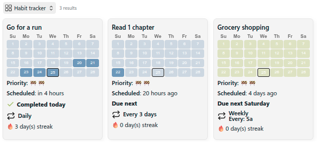

# Obsidian Habit tracker base (With Month overview)

Create beautiful Habit overview with Obsidian bases and the [taskNotes](https://github.com/callumalpass/tasknotes) plugin

[Changelog](./CHANGELOG.md)

## Installation

- Download the bases file and place inside your obsidian vault.
- Grab the CSS file and place inside the `Your-obsidian-vault/.obsidian/snippets` folder.
- Toggle on the snippet in the Appearance tab of the obsidian settings.

## How to use

- Install the **taskNotes** plugin
- The base currently filters tasks that has **contexts** of `personal`, `tag` of `task` and a `tag/type` of `Habit`, this can be changed to match your preferences from the bases filter.
- Embed the base file in any file to apply the `month-overview` class in the `cssClasses` property. As custom CSS cannot be applied to a base file (without being applied to the entirety of the vault), the base file has to be embedded in order to use the custom CSS class.
